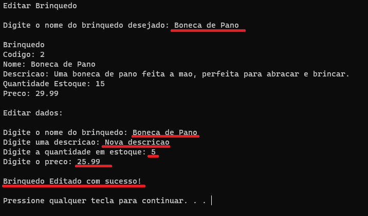

## Projeto de CRUD com Árvore Binária utilizando linguagem C

### Integrantes:
- Ana Carolina
- Rafael Monteiro
- Lucas Buchaul
- Brenno Sciammarella

### Proposta:
- A ideia do projeto é possuir um cadastro de estoque de loja de brinquedos.
- A estrutura de brinquedo possui: "Codigo, Nome, Descricao, Quantidade e Preco" como propriedades.
- Os valores cadastrados de brinquedo ficam referenciados por ponteiro na estrutura da arvore binária.
- É possível executar ações padrões como: "Listar, Cadastrar, Consultrar, Editar e Excluir".
- Ações extras como: "Listar acima de X valor e Listar abaixo de X valor" foram adicionadas como diferencial.

### Árvore Inicial

### Prints do Projeto:

- Menu
  - 

- Listar Brinquedos (ORDEM ALFABETICA)
  - 

- Consultar Brinquedo
  - Brinquedo que não existe:
    - 
  - Brinquedo encontrado:
    - 

- Cadastrar Brinquedo
  - Brinquedo já existe:
    - 
  - Brinquedo novo:
    - 

- Listar Brinquedos com valor acima de:
  - 

- Listar Brinquedos com valor abaixo de:
  - 

- Editar Brinquedo
  - Brinquedo que não existe:
    - 
  - Brinquedo encontrado:
    - 

- Remover Brinquedo
  - Brinquedo que não existe:
    - 
  - Brinquedo encontrado:
    - 
- Sair
